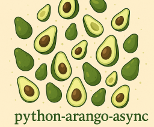

[](https://dl.circleci.com/status-badge/redirect/gh/arangodb/python-arango-async/tree/main)
[](https://github.com/arangodb/python-arango-async/actions/workflows/codeql.yaml)
[](https://github.com/arangodb/python-arango-async/commits/main)

[](https://pypi.org/project/python-arango-async/)
[](https://pypi.org/project/python-arango-async/)

[](https://github.com/arangodb/python-arango/blob/main/LICENSE)
[](https://github.com/psf/black)
[](https://pepy.tech/project/python-arango-async)

# python-arango-async

Python driver for [ArangoDB](https://www.arangodb.com), a scalable multi-model
database natively supporting documents, graphs and search.

This is the _asyncio_ alternative of the [python-arango](https://github.com/arangodb/python-arango)
driver.

**Note: This project is still in active development, features might be added or removed.**

## Requirements

- ArangoDB version 3.11+
- Python version 3.10+

## Installation

```shell
pip install python-arango-async --upgrade
```

## Getting Started

Here is a simple usage example:

```python
from arangoasync import ArangoClient
from arangoasync.auth import Auth


async def main():
    # Initialize the client for ArangoDB.
    async with ArangoClient(hosts="http://localhost:8529") as client:
        auth = Auth(username="root", password="passwd")

        # Connect to "_system" database as root user.
        sys_db = await client.db("_system", auth=auth)

        # Create a new database named "test".
        await sys_db.create_database("test")

        # Connect to "test" database as root user.
        db = await client.db("test", auth=auth)

        # Create a new collection named "students".
        students = await db.create_collection("students")

        # Add a persistent index to the collection.
        await students.add_index(type="persistent", fields=["name"], options={"unique": True})

        # Insert new documents into the collection.
        await students.insert({"name": "jane", "age": 39})
        await students.insert({"name": "josh", "age": 18})
        await students.insert({"name": "judy", "age": 21})

        # Execute an AQL query and iterate through the result cursor.
        cursor = await db.aql.execute("FOR doc IN students RETURN doc")
        async with cursor:
            student_names = []
            async for doc in cursor:
                student_names.append(doc["name"])
```

Another example with [graphs](https://docs.arangodb.com/stable/graphs/):

```python
async def main():
    from arangoasync import ArangoClient
    from arangoasync.auth import Auth

    # Initialize the client for ArangoDB.
    async with ArangoClient(hosts="http://localhost:8529") as client:
        auth = Auth(username="root", password="passwd")

        # Connect to "test" database as root user.
        db = await client.db("test", auth=auth)

        # Get the API wrapper for graph "school".
        if await db.has_graph("school"):
            graph = db.graph("school")
        else:
            graph = await db.create_graph("school")

        # Create vertex collections for the graph.
        students = await graph.create_vertex_collection("students")
        lectures = await graph.create_vertex_collection("lectures")

        # Create an edge definition (relation) for the graph.
        edges = await graph.create_edge_definition(
            edge_collection="register",
            from_vertex_collections=["students"],
            to_vertex_collections=["lectures"]
        )

        # Insert vertex documents into "students" (from) vertex collection.
        await students.insert({"_key": "01", "full_name": "Anna Smith"})
        await students.insert({"_key": "02", "full_name": "Jake Clark"})
        await students.insert({"_key": "03", "full_name": "Lisa Jones"})

        # Insert vertex documents into "lectures" (to) vertex collection.
        await lectures.insert({"_key": "MAT101", "title": "Calculus"})
        await lectures.insert({"_key": "STA101", "title": "Statistics"})
        await lectures.insert({"_key": "CSC101", "title": "Algorithms"})

        # Insert edge documents into "register" edge collection.
        await edges.insert({"_from": "students/01", "_to": "lectures/MAT101"})
        await edges.insert({"_from": "students/01", "_to": "lectures/STA101"})
        await edges.insert({"_from": "students/01", "_to": "lectures/CSC101"})
        await edges.insert({"_from": "students/02", "_to": "lectures/MAT101"})
        await edges.insert({"_from": "students/02", "_to": "lectures/STA101"})
        await edges.insert({"_from": "students/03", "_to": "lectures/CSC101"})

        # Traverse the graph in outbound direction, breath-first.
        query = """
            FOR v, e, p IN 1..3 OUTBOUND 'students/01' GRAPH 'school'
            OPTIONS { bfs: true, uniqueVertices: 'global' }
            RETURN {vertex: v, edge: e, path: p}
            """

        async with await db.aql.execute(query) as cursor:
            async for doc in cursor:
                print(doc)
```

Please see the [documentation](https://python-arango-async.readthedocs.io/en/latest/) for more details.
